# Домашнее задание к занятию «Оркестрация группой Docker-контейнеров на примере Docker Compose» - Моськов Максим

Выполнял на своей виртуальной машине в VirtualBox.

## Окружение

- ВМ: Debian GNU/Linux 12, ядро `6.1.0-29-amd64`.
- Docker: `20.10.24+dfsg1` (был уже установлен из репозитория Debian, пакет `docker.io`).
- Docker Compose plugin: `v5.1.4`. Пакет `docker.io` плагин не содержит, поэтому доустановил его вручную — положил бинарник в системный каталог cli-плагинов:
  ```bash
  sudo mkdir -p /usr/local/lib/docker/cli-plugins
  sudo curl -SL "https://github.com/docker/compose/releases/latest/download/docker-compose-linux-x86_64" \
    -o /usr/local/lib/docker/cli-plugins/docker-compose
  sudo chmod +x /usr/local/lib/docker/cli-plugins/docker-compose
  docker compose version
  ```
- Docker Hub оказался доступен: образ `nginx:1.29.0` скачался напрямую, поэтому файл `/etc/docker/daemon.json` с зеркалами `registry-mirrors` мне не понадобился.
- Пользователь `max` состоит в группе `docker`, поэтому docker-команды выполняю без `sudo`.

---

## Задача 1

Docker и compose-плагин подготовил (см. раздел «Окружение»). Зарегистрировался на https://hub.docker.com (через Google-аккаунт) и создал публичный репозиторий `custom-nginx`.

Скачал базовый образ:
```bash
docker pull nginx:1.29.0
```

Создал рабочий каталог и два файла.

`index.html`:
```html
<html>
<head>
Hey, Netology
</head>
<body>
<h1>I will be DevOps Engineer!</h1>
</body>
</html>
```

`Dockerfile`:
```dockerfile
FROM nginx:1.29.0
COPY index.html /usr/share/nginx/html/index.html
```

Собрал образ:
```bash
docker build -t moskovmaxim/custom-nginx:1.0.0 .
```
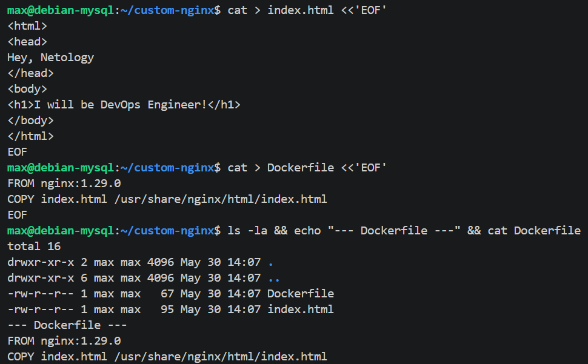

Проверил локально, что дефолтная индекс-страница подменилась на мою:
```bash
docker run -d --name test-nginx -p 8081:80 moskovmaxim/custom-nginx:1.0.0
curl http://127.0.0.1:8081
docker rm -f test-nginx
```
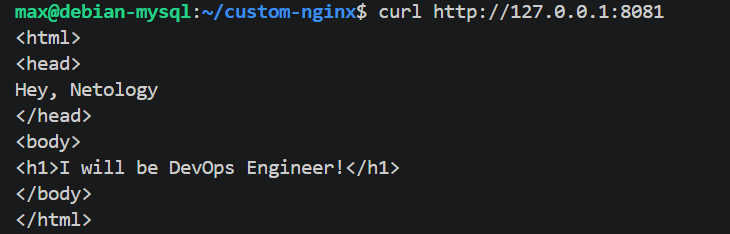

Залогинился и запушил образ с тегом `1.0.0`. Аккаунт у меня заведён через Google (обычного пароля нет), поэтому для `docker login` сгенерировал Personal Access Token и ввёл его вместо пароля:
```bash
docker login -u moskovmaxim
docker push moskovmaxim/custom-nginx:1.0.0
```
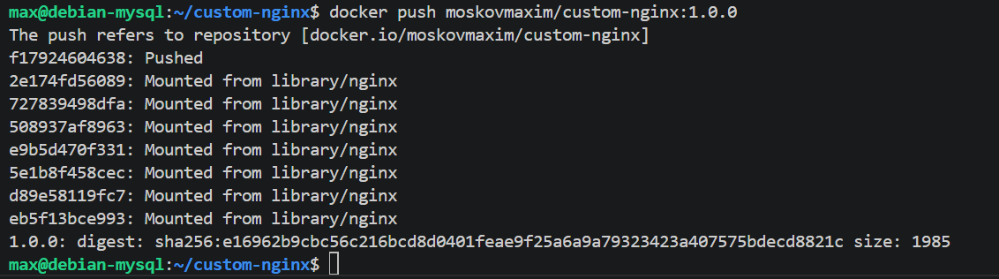

Тег `1.0.0` появился в репозитории на Docker Hub:
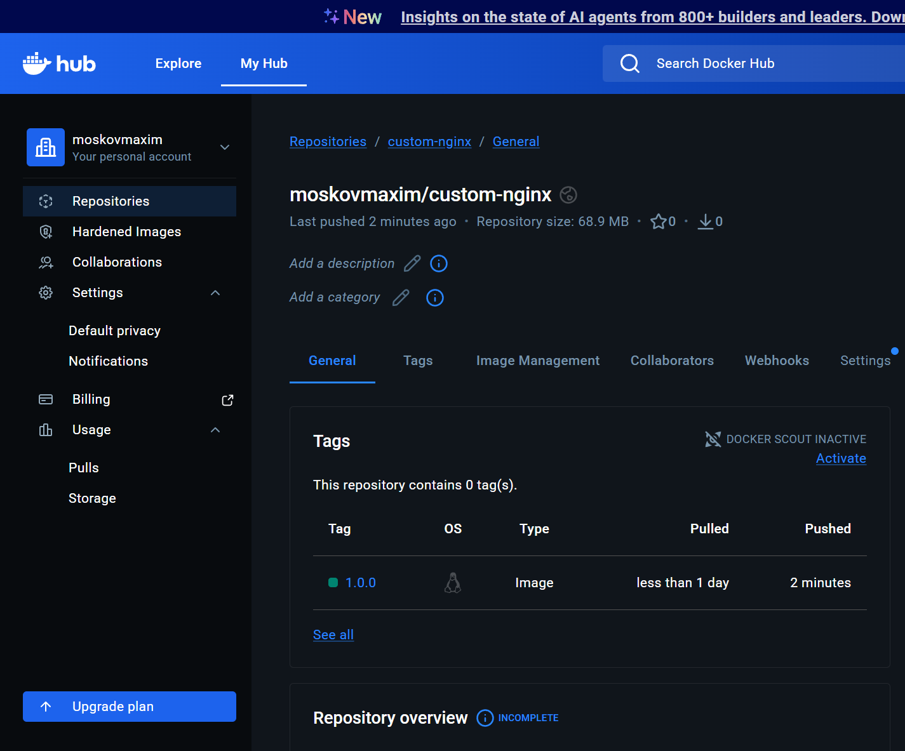

**Ответ:** https://hub.docker.com/repository/docker/moskovmaxim/custom-nginx/general

---

## Задача 2

Чтобы команды совпадали с текстом задания, повесил локальный алиас на свой образ:
```bash
docker tag moskovmaxim/custom-nginx:1.0.0 custom-nginx:1.0.0
```

Запустил контейнер (имя с ФИО, в фоне, публикация строго на `127.0.0.1:8080`) и, не удаляя, переименовал его:
```bash
docker run -d --name Moskov-Maxim-A-custom-nginx-t2 -p 127.0.0.1:8080:80 custom-nginx:1.0.0
docker rename Moskov-Maxim-A-custom-nginx-t2 custom-nginx-t2
```
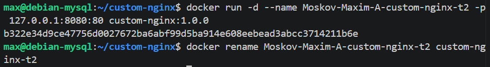

Выполнил команду статуса из задания:
```bash
date +"%d-%m-%Y %T.%N %Z" ; sleep 0.150 ; docker ps ; ss -tlpn | grep 127.0.0.1:8080 ; docker logs custom-nginx-t2 -n1 ; docker exec -it custom-nginx-t2 base64 /usr/share/nginx/html/index.html
```
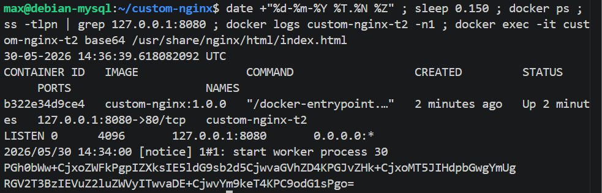

Проверил доступность индекс-страницы:
```bash
curl http://127.0.0.1:8080
```
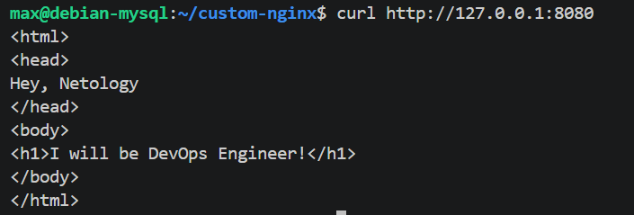

---

## Задача 3

Подключился к стандартным потокам ввода/вывода/ошибок контейнера командой `docker attach` и нажал `Ctrl-C`:
```bash
docker attach custom-nginx-t2
```
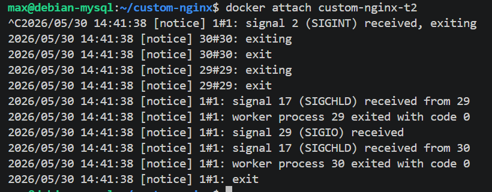

```bash
docker ps -a
```
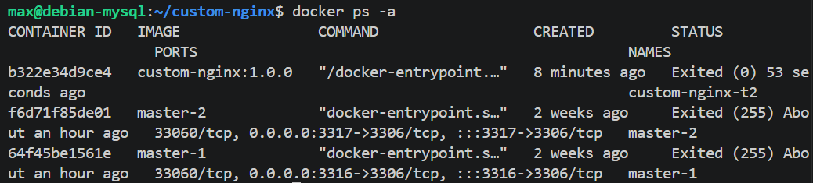

**Почему контейнер остановился.** `docker attach` подключает мой терминал к главному процессу контейнера (PID 1) — это nginx master, запущенный на переднем плане. `Ctrl-C` отправляет ему сигнал SIGINT, который nginx воспринимает как команду завершения. Контейнер живёт ровно столько, сколько жив его процесс с PID 1, поэтому, когда nginx завершился, контейнер остановился. (Если бы я зашёл через `docker exec`, то запустился бы отдельный процесс и `Ctrl-C` не затронул бы PID 1.)

Перезапустил контейнер и зашёл в интерактивный bash:
```bash
docker start custom-nginx-t2
docker exec -it custom-nginx-t2 bash
```
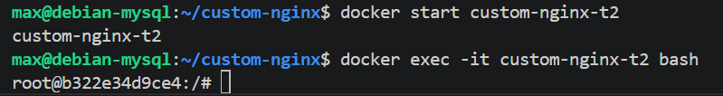

Установил текстовый редактор (заодно `curl` — в базовом образе nginx его нет, а он нужен дальше):
```bash
apt-get update && apt-get install -y nano curl
```


В файле `/etc/nginx/conf.d/default.conf` заменил `listen 80` на `listen 81`:
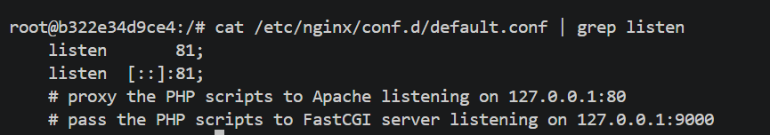

Перечитал конфиг и проверил порты изнутри контейнера:
```bash
nginx -s reload
curl http://127.0.0.1:80 ; curl http://127.0.0.1:81
```
На порту 80 — `Connection refused`, на 81 — моя страница.
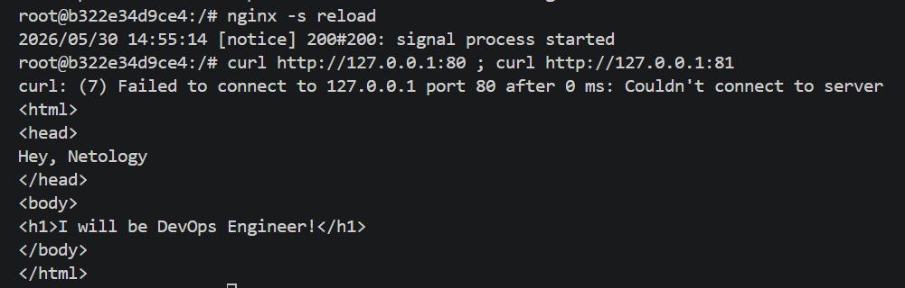

Вышел из контейнера и проверил ситуацию с хоста:
```bash
exit
ss -tlpn | grep 127.0.0.1:8080
docker port custom-nginx-t2
curl http://127.0.0.1:8080
```
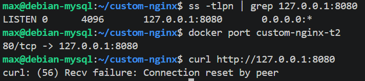

**Суть возникшей проблемы.** Публикация порта `127.0.0.1:8080 -> 80/tcp` задаётся при создании контейнера и для уже запущенного контейнера неизменна. Я переключил nginx на порт 81 внутри контейнера, но хостовый порт 8080 по-прежнему пробрасывается на порт **80** контейнера, где теперь никто не слушает. Поэтому со стороны хоста порт 8080 формально открыт (его держит docker-proxy), но запросы умирают — на целевом порту 80 внутри контейнера нет сервиса. Внутренний порт приложения и опубликованный маппинг рассинхронизировались.

Удалил работающий контейнер без остановки (флаг `-f`):
```bash
docker rm -f custom-nginx-t2
```
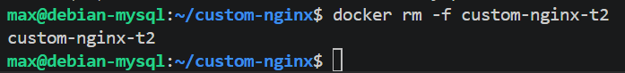

---

## Задача 4

Запустил два контейнера в фоне, примонтировав текущий рабочий каталог в `/data`. Базовые образы без команды сразу завершаются, поэтому, чтобы они работали в фоне, передал им `sleep infinity`:
```bash
mkdir -p ~/task4 && cd ~/task4
docker run -d --name centos1 -v $(pwd):/data centos:7 sleep infinity
docker run -d --name debian1 -v $(pwd):/data debian sleep infinity
docker ps
```
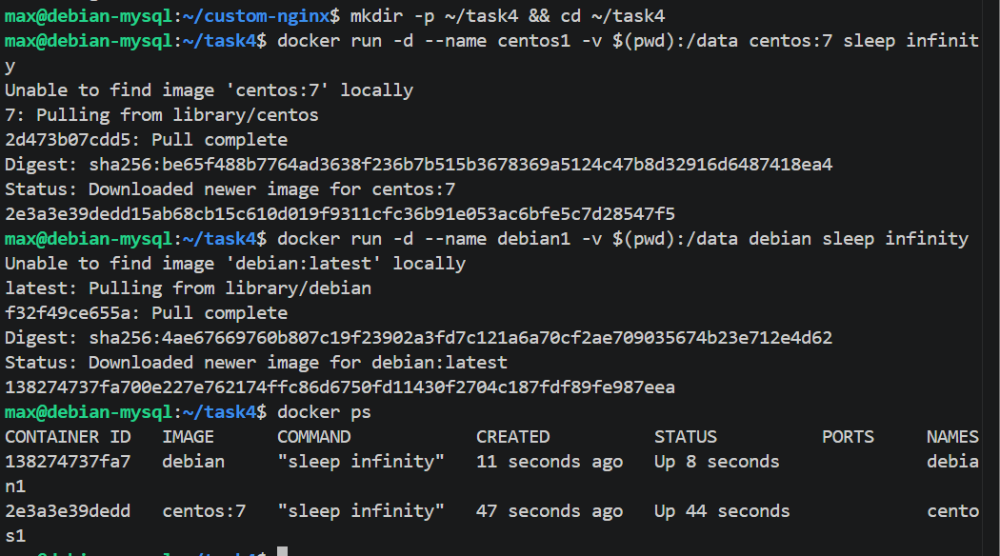

Подключился к первому контейнеру (centos) и создал текстовый файл в `/data`:
```bash
docker exec -it centos1 bash
echo "file from centos container" > /data/from-centos.txt
ls -la /data
exit
```
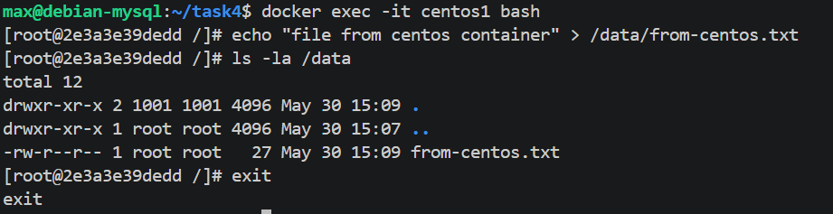

Добавил ещё один файл в каталог `$(pwd)` уже на хосте:
```bash
echo "file created on host" > ~/task4/from-host.txt
ls -la ~/task4
```
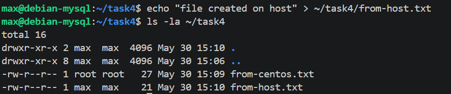

Подключился ко второму контейнеру (debian) и посмотрел листинг и содержимое `/data`:
```bash
docker exec -it debian1 bash
ls -la /data
cat /data/from-centos.txt
cat /data/from-host.txt
exit
```
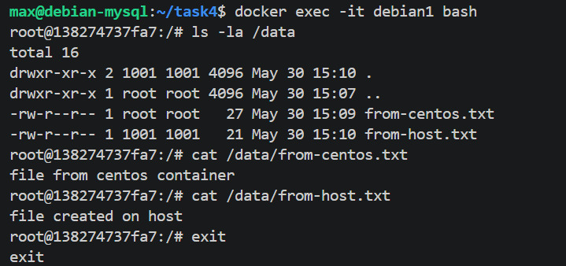

В `/data` второго контейнера видны оба файла. Оба контейнера примонтировали одну и ту же папку хоста через ключ `-v`, поэтому файл, созданный из контейнера centos, и файл, созданный на хосте, доступны в debian. Bind-mount — это общая с хостом директория, а не копия: изменения сразу видны всем, кто её примонтировал.

---

## Задача 5

### 1. Какой файл запустился и почему

Создал каталог и два файла.

`compose.yaml`:
```yaml
version: "3"
services:
  portainer:
    network_mode: host
    image: portainer/portainer-ce:latest
    volumes:
      - /var/run/docker.sock:/var/run/docker.sock
```

`docker-compose.yaml`:
```yaml
version: "3"
services:
  registry:
    image: registry:2

    ports:
    - "5000:5000"
```

```bash
docker compose up -d
docker compose ps
```
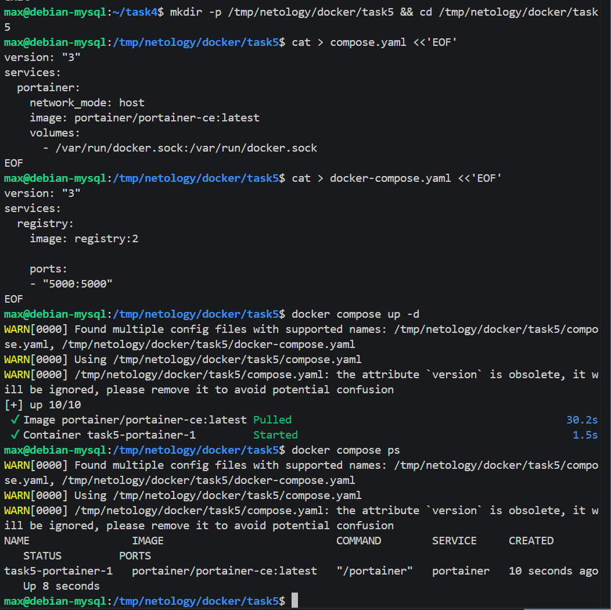

Запустился **`compose.yaml`** — поднялся только сервис `portainer`. По спецификации Compose у конфигурационных файлов есть порядок приоритета: Compose берёт первый подходящий в последовательности `compose.yaml` → `compose.yml` → `docker-compose.yaml` → `docker-compose.yml`. Имя `compose.yaml` — каноническое (предпочтительное), а `docker-compose.yaml` поддерживается для обратной совместимости и имеет более низкий приоритет. Compose даже сам сообщает об этом в выводе: `Found multiple config files ... Using .../compose.yaml`.

### 2. Запуск обоих файлов через include

Переписал `compose.yaml`, добавив директиву `include`:
```yaml
include:
  - docker-compose.yaml

services:
  portainer:
    network_mode: host
    image: portainer/portainer-ce:latest
    volumes:
      - /var/run/docker.sock:/var/run/docker.sock
```
```bash
docker compose up -d
docker compose ps
```
Теперь `compose.yaml` через `include` подтягивает `docker-compose.yaml`, и поднимаются оба сервиса — `portainer` и `registry`:
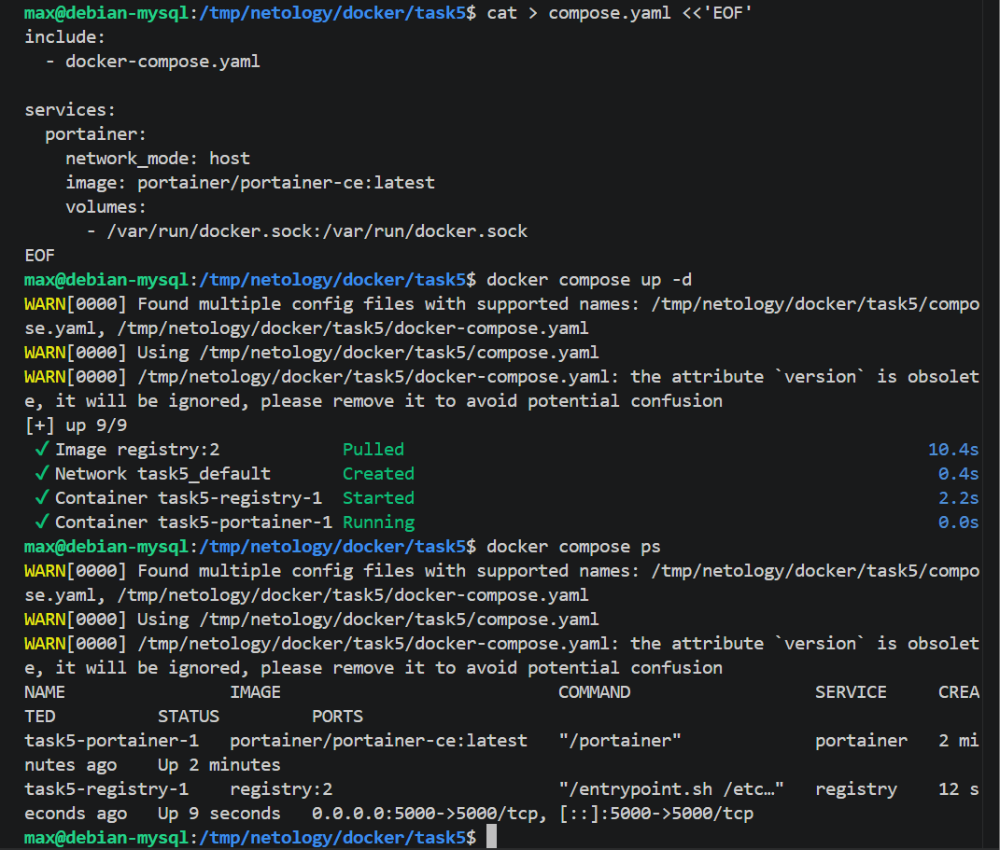

### 3. Заливка custom-nginx в локальный registry

```bash
docker tag custom-nginx:1.0.0 127.0.0.1:5000/custom-nginx:latest
docker push 127.0.0.1:5000/custom-nginx:latest
curl http://127.0.0.1:5000/v2/_catalog
curl http://127.0.0.1:5000/v2/custom-nginx/tags/list
```
Push в registry на `127.0.0.1:5000` прошёл по HTTP без правки `insecure-registries` — Docker по умолчанию разрешает незащищённые registry на loopback-адресах. Каталог registry подтверждает, что образ залит.
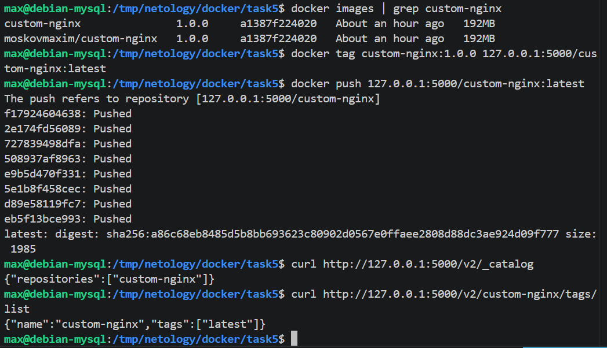

### 4. Начальная настройка portainer

ВМ работает за NAT, поэтому веб-интерфейс portainer (порт 9000) пробросил на хост через проброс портов VirtualBox (`127.0.0.1:9000 -> 9000`) и открыл `http://localhost:9000`. Создал администратора с логином `admin`.
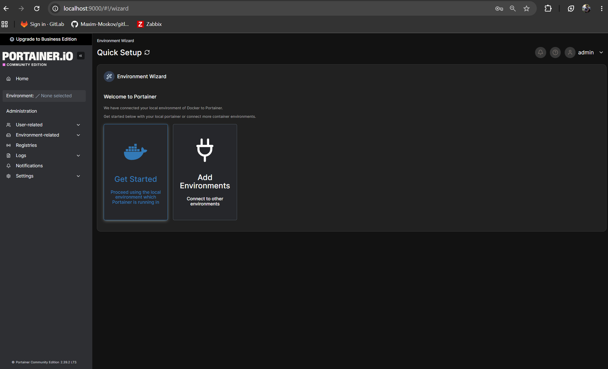

### 5. Деплой стека через portainer

Выбрал локальное окружение → **Stacks** → **Add stack** → **Web editor**:
```yaml
version: '3'

services:
  nginx:
    image: 127.0.0.1:5000/custom-nginx
    ports:
      - "9090:80"
```
Стек задеплоился, portainer вытянул образ из локального registry и поднял nginx на порту 9090.
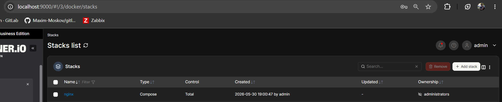

### 6. Inspect контейнера

**Containers** → контейнер nginx → **Inspect** → представление `<> Tree` → развернул узел `Config`. Скриншот диапазона полей от `AppArmorProfile` до `Driver`:


### 7. Удаление манифеста, warning и гашение проекта

Удалил `compose.yaml` (тот, что с `include`) и выполнил `docker compose up -d`:
```bash
rm compose.yaml
docker compose up -d
```
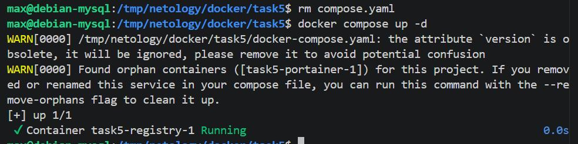

**Суть предупреждения.** После удаления `compose.yaml` в проекте `task5` остался только `docker-compose.yaml` с сервисом `registry`. Но контейнер `task5-portainer-1` всё ещё запущен и помечен как принадлежащий проекту `task5`, хотя в актуальной конфигурации Compose сервиса `portainer` больше нет. Compose сообщает об «осиротевших» контейнерах (orphan containers) — это контейнеры проекта, которых нет в текущем compose-файле, — и предлагает удалить их флагом `--remove-orphans`.

Выполнил предложенное действие:
```bash
docker compose up -d --remove-orphans
```
Осиротевший `task5-portainer-1` удалён:
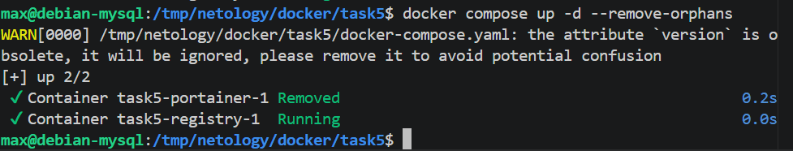

Погасил compose-проект одной командой:
```bash
docker compose down
```
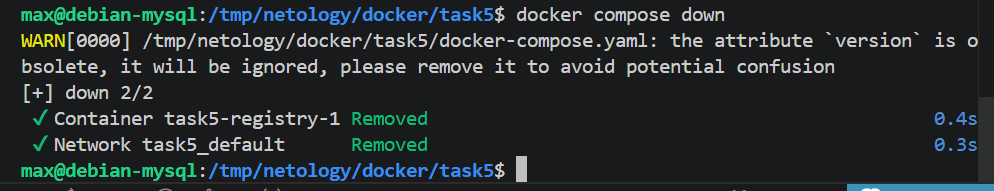

`docker compose down` одной командой остановил и удалил все контейнеры и сеть (`task5_default`), созданные `up` для проекта.
